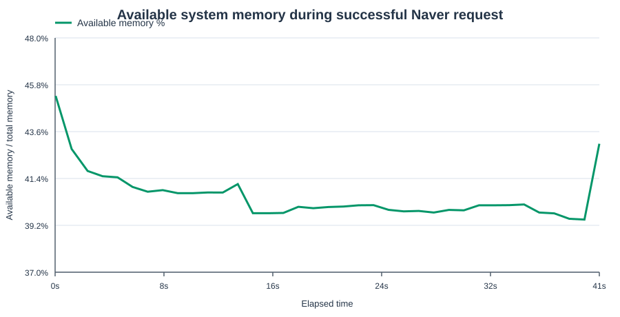
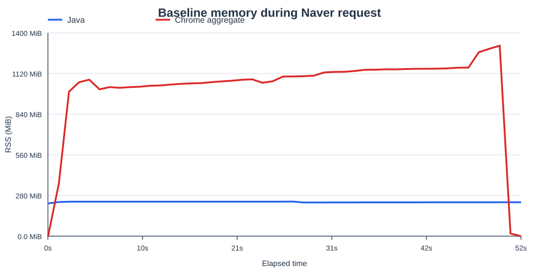
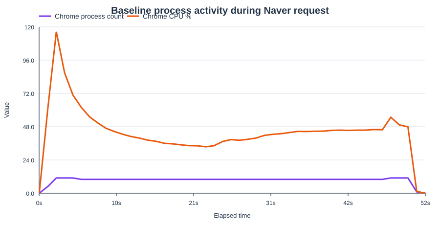

# Naver headless baseline

The canonical baseline is documented in [PR #22](https://github.com/YatinKare/map-data-fetcher/pull/22).
The measurements below come from the successful body-validated run on 2026-09-12.

## Environment

| Component | Version or value |
| --- | --- |
| Java | 17.0.20 |
| Selenium Java | 4.49.0 |
| Chrome | 151.0.7922.108 |
| ChromeDriver | 151.0.7922.108 |
| Host CPU | 4 cores |
| Host memory | 5.59 GiB |
| Browser mode | Headless |

## Request and timing

| Metric | Value |
| --- | ---: |
| Query | `노원역 맛집` |
| HTTP status | 200 |
| JSON type | Array |
| Place results | 20 |
| Response size | 86,793 bytes |
| Startup time | 8.21 s |
| Naver request time | 40.16 s |
| Total run time | 49.51 s |
| Available memory at start | 45.28% |
| Available memory at end | 43.03% |

## Peak resource usage

| Component | Processes | Aggregate RSS | CPU | Threads |
| --- | ---: | ---: | ---: | ---: |
| Java | 1 | 245 MiB | 279% | 54 |
| Chrome | 11 | 1,324 MiB | 58.8% | 119 |

Chrome RSS is summed across its child processes and can count shared pages more than once. It is a conservative aggregate, not unique/private memory.







## Re-running the baseline

Run the script after building the application:

```bash
./gradlew bootJar -x test
./tests/run-script
```

Each run writes a timestamped JSON report under `runs/baseline/`. Those generated reports are intentionally ignored and are not committed.
